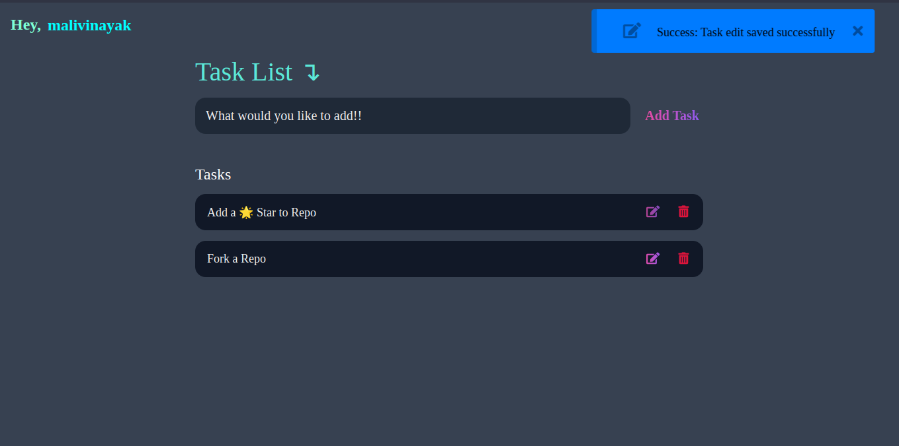

<h1 align="center">📃To Do Manager</h1>

[](https://github.com/malivinayak/To-Do-Manager/releases/latest)
[](https://malivinayak.github.io/To-Do-Manager/)
[](https://github.com/malivinayak/To-Do-Manager/pulls?q=is%3Apr+is%3Aclosed)
[](https://github.com/malivinayak/To-Do-Manager/issues?q=is%3Aissue+is%3Aclosed)


<!--  -->
<!--  -->


<hr>

**Table of Contents**

- [About The Project](#about-the-project)
- [Features](#features)
- [Platform Support](#platform-support)
- [Languages and Tools](#languages-and-tools)
- [Directory Hierarchy](#directory-hierarchy)
- [Author](#author)
- [Contributors](#contributors)
- [Contributing](#contributing)


## About The Project 
To-do Manager is a web development project using HTML, CSS & JavaScript with local storage. Along with front-end To-Do-Manager demonstrate CRUD operation on local storage. [CRUD operation -> Create, Read, Update, and Delete(CRUD)]

To-Do-Manager is a web app used to maintain our day-to-day tasks or list everything that we have to do. This project provides an easy way to add, edit and delete tasks. Added tasks will be stored in the browser’s local storage so, they won’t be removed on page refresh or tab close.

<h3> <b>Let's Try To-Do-Manager</b> - <a href="https://malivinayak.github.io/To-Do-Manager/">Click me to manage your To-Do list</a> </h3>

## Features
- Add task
- Edit task
- Delete task
- Save & Fetch Task 
- Save Your Name

## Platform Support
🔳 android  
🔳 linux  
✅ [web](https://malivinayak.github.io/To-Do-Manager/)  
🔳 windows  

## Languages and Tools

<code></code>  &nbsp; &nbsp; 
<code></code> &nbsp; &nbsp;
<code></code> &nbsp; &nbsp;
<code></code>

## Directory Hierarchy
```css
|—— assets
|    |—— main.css
|    |—— main.js
|    |—— custom-alert
|        |—— alert.css
|        |—— alert.js
|    |—— name
|        |—— storeName.css
|        |—— storeName.js
|    |—— to-do-task
|        |—— loadTask.js
|        |—— storeTask.js
|—— index.html
```

## Author
<b>Vinayak Mali (@malivinayak)</b>

## Contributors

<!-- readme: contributors -start -->
<table>
<tr>
    <td align="center">
        <a href="https://github.com/malivinayak">
            
            <br />
            <sub><b>Vinayak Mali</b></sub>
        </a>
    </td>
    <td align="center">
        <a href="https://github.com/GbCderr14">
            
            <br />
            <sub><b>Gaurang Bhutani</b></sub>
        </a>
    </td>
    <td align="center">
        <a href="https://github.com/amripandey">
            
            <br />
            <sub><b>Amrit Pandey</b></sub>
        </a>
    </td>
    <td align="center">
        <a href="https://github.com/Mouli-3542">
            
            <br />
            <sub><b>Chandra Mouli</b></sub>
        </a>
    </td>
    <td align="center">
        <a href="https://github.com/nikhilgarg26">
            
            <br />
            <sub><b>Nikhil Garg</b></sub>
        </a>
    </td>
    <td align="center">
        <a href="https://github.com/rahmlad-aramide">
            
            <br />
            <sub><b>Oladimeji Abdrahman Adebayo</b></sub>
        </a>
    </td></tr>
<tr>
    <td align="center">
        <a href="https://github.com/vens8">
            
            <br />
            <sub><b>Rahul Maddula</b></sub>
        </a>
    </td>
    <td align="center">
        <a href="https://github.com/RaviTejaVattem">
            
            <br />
            <sub><b>Null</b></sub>
        </a>
    </td></tr>
</table>
<!-- readme: contributors -end -->

We thank all the contributors to this project, more contributors are welcome!

## Contributing
Contributions are what make the open source community such an amazing place to be learn, inspire, and create. Any contributions you make are greatly appreciated.

1. Fork the Project
2. Create your Feature Branch (git checkout -b feature-AmazingFeature)
3. Commit your Changes (git commit -m 'Add some AmazingFeature')
4. Push to the Branch (git push origin feature/AmazingFeature)
5. Open a Pull Request

<p align="center"><b>You can show some ❤️ by starring the repository!</b></p>
